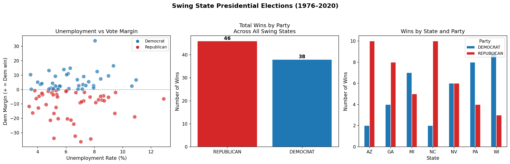

# Can GDP and Unemployment Predict Who Wins Swing States?

## Hook
Four years come, and a few states pick the president. Political operators bicker over debates and attack ads, but history may already hold the answer. When it hurts financially, Americans vote for change.

## Problem Statement
Pennsylvania, Michigan, Wisconsin, Arizona, Nevada, Georgia, and North Carolina have decided the last few presidential elections. However, correctly forecasting the outcome in these swing states has proven extremely difficult. National polls have notoriously missed the mark which leaves politicians, media members, and voters alike without good predictions. Political science has found that things like unemployment, GDP growth, and median income can tell us how people will vote. So why not create a model that only uses economic indicators to predict which party will win each swing state?

## Solution Description
This project consolidates decades of unemployment data with presidential election results from seven key swing states. The data is stored in MongoDB and analyzed using logistic regression to determine which economic factors correlate most closely with swing state outcomes. The result is a data-driven model that attempts to predict election winners from economic data alone — no polls necessary. Our findings show that unemployment rate alone achieves 53% accuracy, suggesting elections are driven by many factors beyond a single economic indicator.

## Chart

The chart above shows unemployment rate plotted against Democratic vote margin across all seven swing states from 1976 to 2020. Blue dots represent Democrat 
wins and red dots represent Republican wins. The lack of a clear pattern illustrates why predicting swing state outcomes is so difficult — even with 
economic data in hand.

## Data
This project uses 84 documents stored in MongoDB Atlas, combining presidential election results from the MIT Election Lab (1976–2020) with monthly state 
unemployment rates from the Federal Reserve Economic Data (FRED) database.